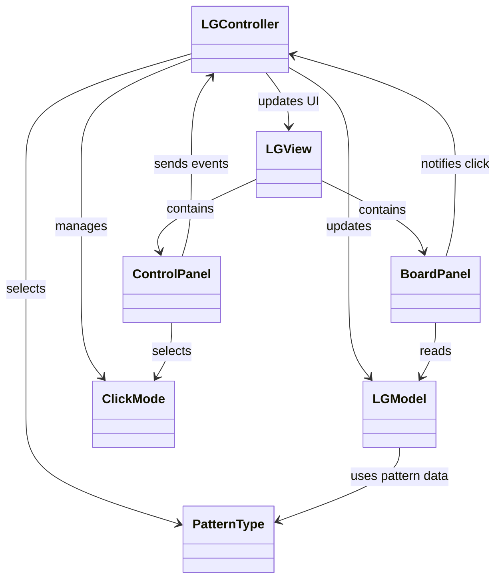
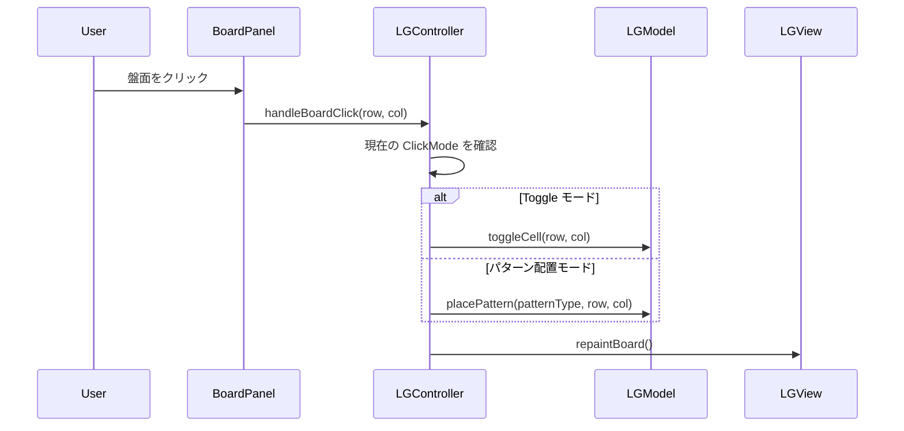
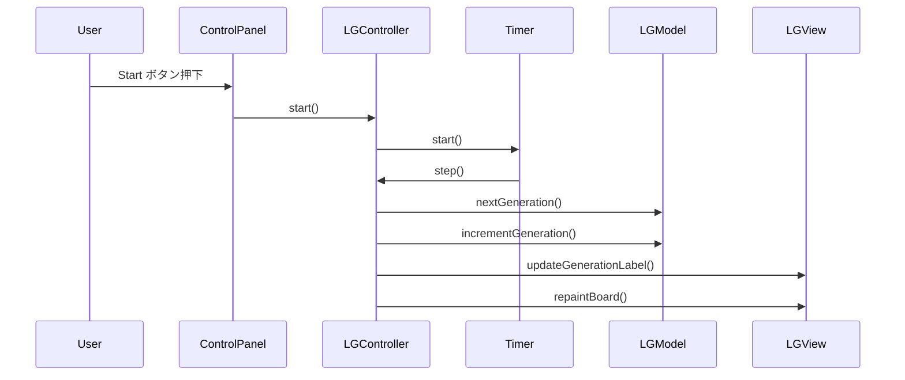
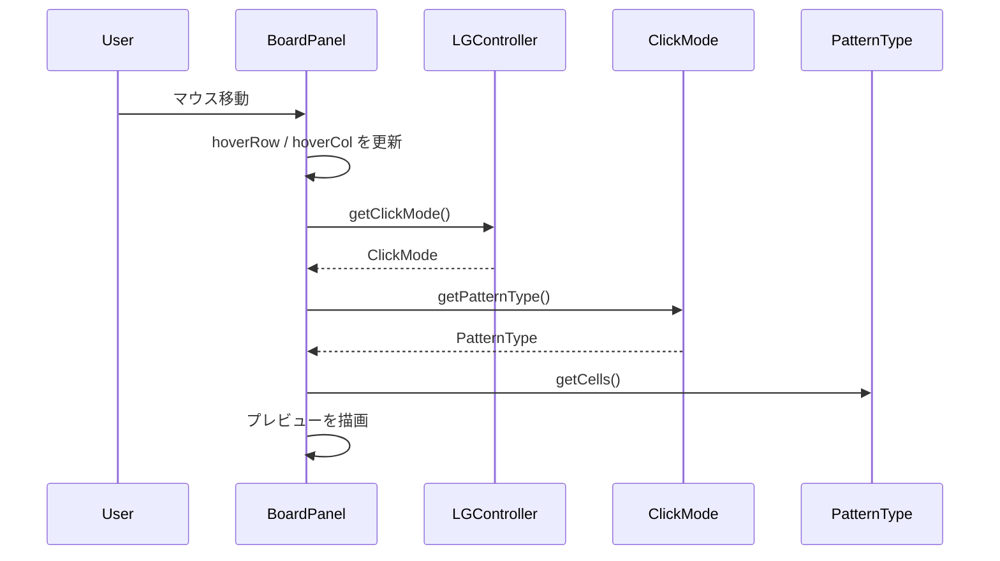

# LifeGame

Swingで開発したライフゲームアプリです。  
マウス操作でセルの状態を切り替えたり、各種パターンを配置したりしながら、世代ごとの変化を視覚的に確認できます。  
設計面では、MVC設計やリファクタリングを通して段階的に機能を拡張しています。

---

## ■ 主な機能

- セルのクリックによる ON / OFF 切り替え
- ドラッグによるセル描画（Toggleモード）
- 世代の自動更新（Start / Stop）
- ランダム配置（Random）
- 全消去（Clear）
- 更新速度の変更（JSlider）
- 世代数表示（Generation）
- 状態表示（Running / Stopped）
- Start / Stop ボタンの有効・無効制御
- モード選択用プルダウン

### パターン配置

- Glider
- Block
- Blinker
- Toad
- Beacon
- Gosper Glider Gun

### プレビュー機能

- マウス位置にパターンの仮配置を表示
- 配置可能な場合：半透明表示
- 配置不可な場合：赤色表示

---

## ■ 操作方法

- 盤面クリック  
  現在のモードに応じてセルの反転またはパターン配置を行います

- ドラッグ（Toggleモード）  
  通過したセルを1回ずつ反転します

- Start  
  シミュレーションを開始します

- Stop  
  シミュレーションを停止します

- Random  
  盤面をランダムな状態で初期化します

- Clear  
  盤面をすべてクリアします

- Speed スライダー  
  世代更新の間隔を変更します

- Mode プルダウン  
  クリック時の動作モードを切り替えます
  - Toggle
  - Glider
  - Block
  - Blinker
  - Toad
  - Beacon
  - Gosper Glider Gun

---

## ■ パッケージ構成

```text
LGMain            // アプリケーションのエントリーポイント

controller
├─ LGController   // 入力制御、タイマー管理、状態更新
└─ ClickMode      // 盤面クリック時の動作モード

model
├─ LGModel        // ライフゲームの状態管理と更新処理
└─ PatternType    // パターン定義と表示名

view
├─ LGView         // 画面全体の構成
├─ BoardPanel     // 盤面描画とマウス入力
└─ ControlPanel   // 操作UI（ボタン、スライダー、プルダウン、表示ラベル）
```

---

## ■ クラス図



---

## ■ シーケンス図（盤面クリック時の処理）



---

## ■ シーケンス図（Startして1世代進むときの処理）



---

## ■ シーケンス図（プレビュー表示時の処理）



---

## ■ 今後の改善

- ループ検出や停止条件の強化
- 保存 / 読み込み機能

---

## ■ 学習ポイント

- Swing による GUI 開発
- MVC設計の実践
- イベント駆動プログラミング
- View の責務分離
- enum を使った状態管理
