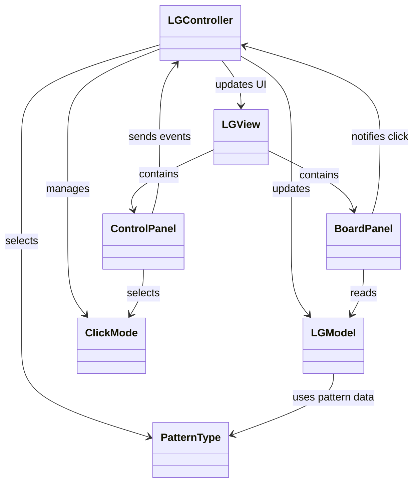
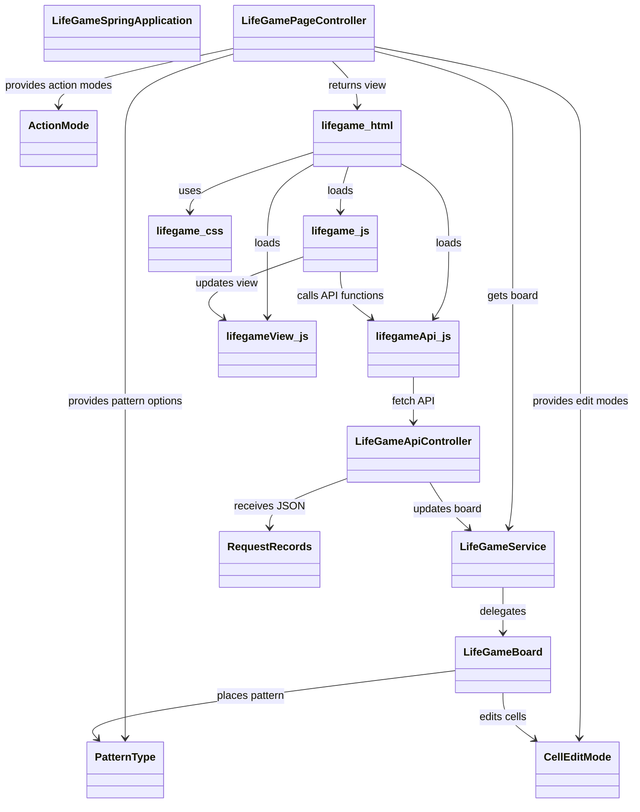
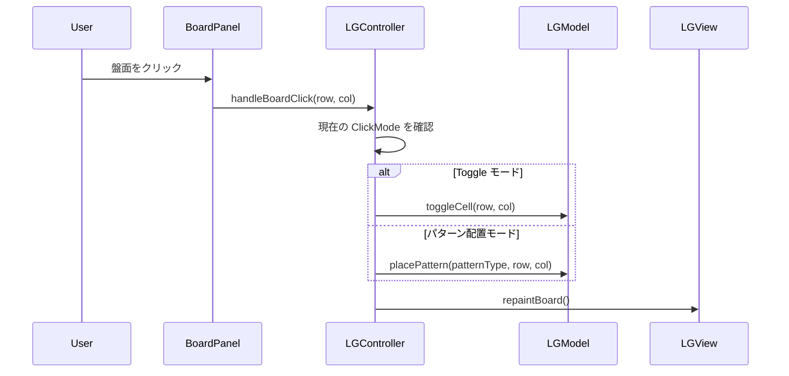
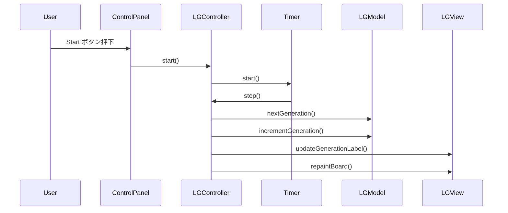
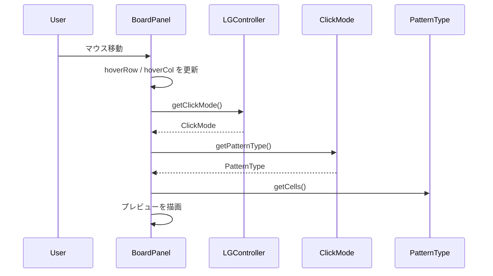
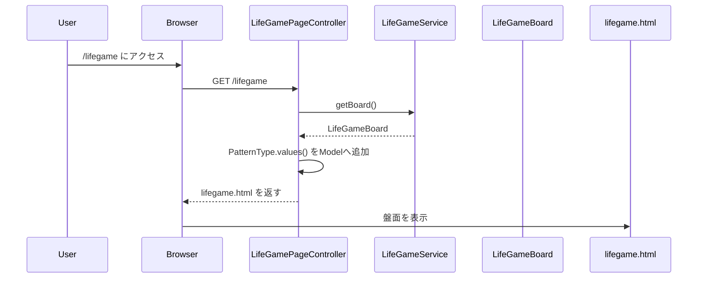
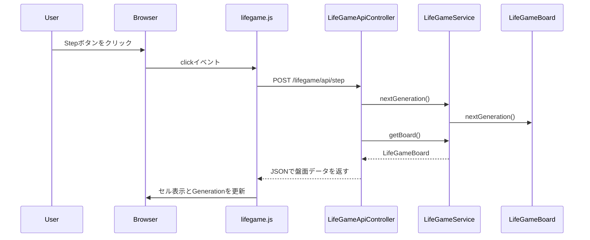
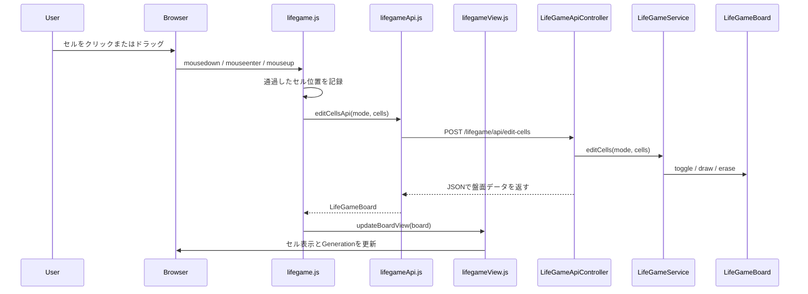
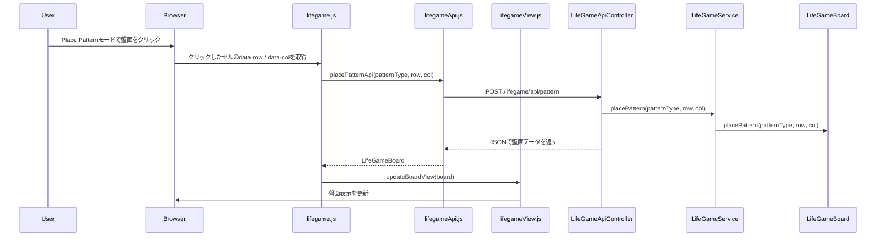

# LifeGame

ライフゲームを題材にしたJava学習用プロジェクトです。

最初にJava Swingでデスクトップアプリ版を作成し、その後、Spring Boot / Thymeleaf / JavaScriptを使ってWebアプリ版へ発展させています。

Swing版では、MVC設計、イベント駆動プログラミング、GUI部品の責務分離を学習しています。  
Spring Boot版では、Controller / Service / Model の分離、Thymeleafによる初期表示、JavaScript + fetch APIによる画面更新を学習しています。

## ■ バージョン

このリポジトリには、以下の2つの実装を含めています。

### Swing版

Java Swingで作成したデスクトップアプリ版です。  
盤面描画、マウス操作、タイマー処理、パターン配置、プレビュー表示などをSwingで実装しています。

### Spring Boot版

Spring Bootで作成したWebアプリ版です。  
Swing版で作成したライフゲームの考え方をもとに、Web画面、API、JavaScriptによる部分更新へ発展させています。

## ■ 主な機能

### 共通

- セルクリックによる ON / OFF 切り替え
- ドラッグによるセル描画（Toggleモード）
- 1世代だけ進める Step 操作
- 世代の自動更新（Start / Stop）
- ランダム配置（Random）
- 全消去（Clear）
- 初期状態へのリセット（Reset）
- 更新速度の変更（Speed スライダー）
- 世代数表示（Generation）
- パターン配置
  - Glider
  - Block
  - Blinker
  - Toad
  - Beacon
  - Gosper Glider Gun
- クリック位置へのパターン配置
- パターン配置時のプレビュー表示

### Swing版

- 状態表示（Running / Stopped）

### Spring Boot版

- ブラウザ上でのライフゲーム盤面表示
- 盤面操作モード選択（Edit Cell / Place Pattern）
- 描画モード選択（Toggle / Draw / Erase）

## ■ 操作方法

### 共通

- セルクリック  
  クリックしたセルの生死を切り替えます
- Step  
  盤面を1世代だけ進めます
- Start  
  自動更新を開始します
- Stop  
  自動更新を停止します
- Speed スライダー  
  自動更新の間隔を変更します
- Clear  
  盤面をすべてクリアします
- Reset  
  初期状態のパターンに戻します
- Random  
  盤面をランダムな状態にします
- Pattern プルダウン  
  配置するパターンを選択します

### Swing版

- ドラッグ（Toggleモード）  
  通過したセルを1回ずつ反転します

### Spring Boot版

- Action Mode プルダウン  
  盤面クリック時の大きな動作を切り替えます
  - Edit Cell
  - Place Pattern
- Edit Mode プルダウン  
  Edit Cellモード時のセル編集方法を切り替えます
  - Toggle
  - Draw
  - Erase
- ドラッグ（Edit Cellモード）  
  選択中のEdit Modeに応じて、通過したセルをまとめて編集します
- Action Mode: Place Pattern  
  Patternプルダウンで選択したパターンを、クリックした位置に配置します

## ■ パッケージ構成

### Swing版

```text
src
├─ LGMain.java            // アプリケーションのエントリーポイント
├─ controller
│  ├─ LGController.java   // 入力制御、タイマー管理、状態更新
│  └─ ClickMode.java      // 盤面クリック時の動作モード
├─ model
│  ├─ LGModel.java        // ライフゲームの状態管理と更新処理
│  └─ PatternType.java    // パターン定義と表示名
└─ view
   ├─ LGView.java         // 画面全体の構成
   ├─ BoardPanel.java     // 盤面描画とマウス入力
   └─ ControlPanel.java   // 操作UI（ボタン、スライダー、プルダウン、表示ラベル）
```

### Spring Boot版

```text
spring
├─ src/main/java/com/mkunori/lifegame
│  ├─ LifeGameSpringApplication.java    // Spring Bootアプリケーションのエントリーポイント
│  ├─ controller
│  │  ├─ LifeGamePageController.java    // ライフゲーム画面の表示を担当
│  │  ├─ LifeGameApiController.java     // JavaScriptから呼び出されるAPIを担当
│  │  └─ request                        // JSONリクエストを受け取るrecord群
│  ├─ model
│  │  ├─ LifeGameBoard.java             // 盤面状態とライフゲームのルールを管理
│  │  ├─ PatternType.java               // 配置できるパターンの種類を定義
│  │  ├─ CellEditMode.java              // Toggle / Draw / Erase を定義
│  │  ├─ CellPosition.java              // 盤面上の1つのセル位置を表す値オブジェクト
│  │  └─ ActionMode.java                // Edit Cell / Place Pattern を定義
│  └─ service
│     └─ LifeGameService.java           // ControllerとModelの間で処理を仲介
└─ src/main/resources
   ├─ templates
   │  └─ lifegame.html                  // 初期画面を表示するThymeleafテンプレート
   └─ static
      ├─ css
      │  └─ lifegame.css                // 画面デザイン
      └─ js
         ├─ lifegameApi.js              // Spring Boot API呼び出しを担当
         ├─ lifegameView.js             // 盤面や世代数の画面更新を担当
         └─ lifegame.js                 // イベント登録、自動再生、ドラッグ操作などを担当

<初期表示>
ブラウザ
↓
GET /lifegame
↓
LifeGamePageController
↓
lifegame.html

<画面操作>
lifegame.js
↓
lifegameApi.js
↓
POST /lifegame/api/...
↓
LifeGameApiController
↓
LifeGameService
↓
LifeGameBoard
↓
JSONで盤面データを返す
↓
lifegameView.js が画面を更新
```


## ■ クラス図

### Swing版



### Spring Boot版



## ■ シーケンス図

### Swing版

#### 盤面クリック時の処理



#### Startして1世代進むときの処理



#### プレビュー表示時の処理



### Spring Boot版

#### 初期表示



#### Step API



#### セルToggle API



#### パターン配置API（クリック位置に配置）



## ■ 今後の改善

### Swing版

- ループ検出や停止条件の強化
- 保存 / 読み込み機能

### Spring Boot版

- パターン配置時のプレビュー表示
- パターン配置時のはみ出し表示や配置可否の見える化
- 盤面サイズ変更機能
- セッションごとの盤面管理
- APIリクエスト用recordとModel側の値オブジェクトの整理
- JavaScriptのさらなる責務分離

---

## ■ 学習ポイント

### Swing版

- Swing による GUI 開発
- MVC設計の実践
- イベント駆動プログラミング
- View の責務分離
- enum を使った状態管理

### Spring Boot版

- Spring BootによるWebアプリケーション開発
- Controller / Service / Model の責務分離
- `@Controller` と `@RestController` の使い分け
- Thymeleafによる初期画面表示
- JavaScriptのfetch APIによる非同期通信
- JSONを使った画面更新
- JSONリクエストを `@RequestBody` と record で受け取る実装
- enumを使ったパターン選択、操作モード、編集モードの管理
- ドラッグ描画時に複数セルをまとめて送信するAPI設計
- JavaScriptファイルの責務分離
  - API呼び出し
  - 画面更新
  - イベント制御
