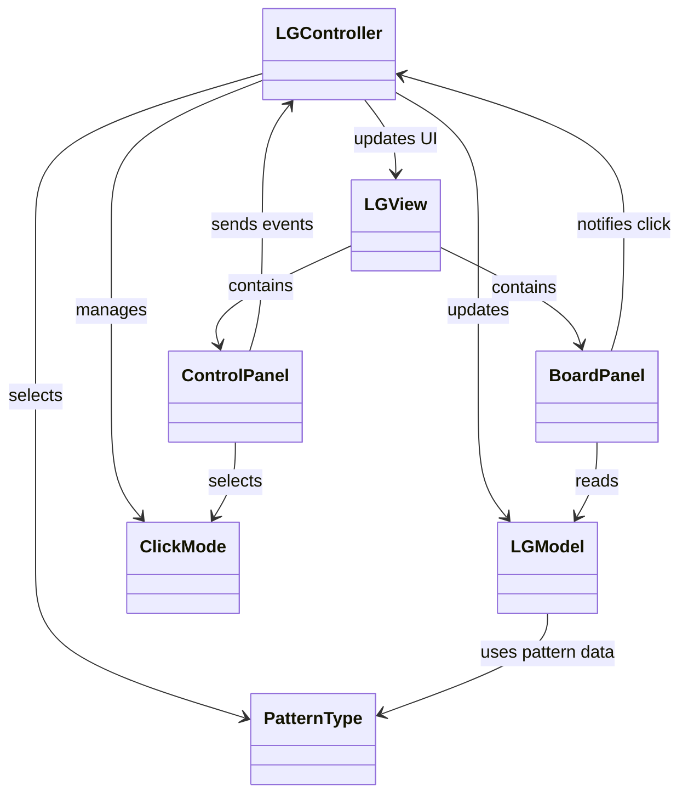
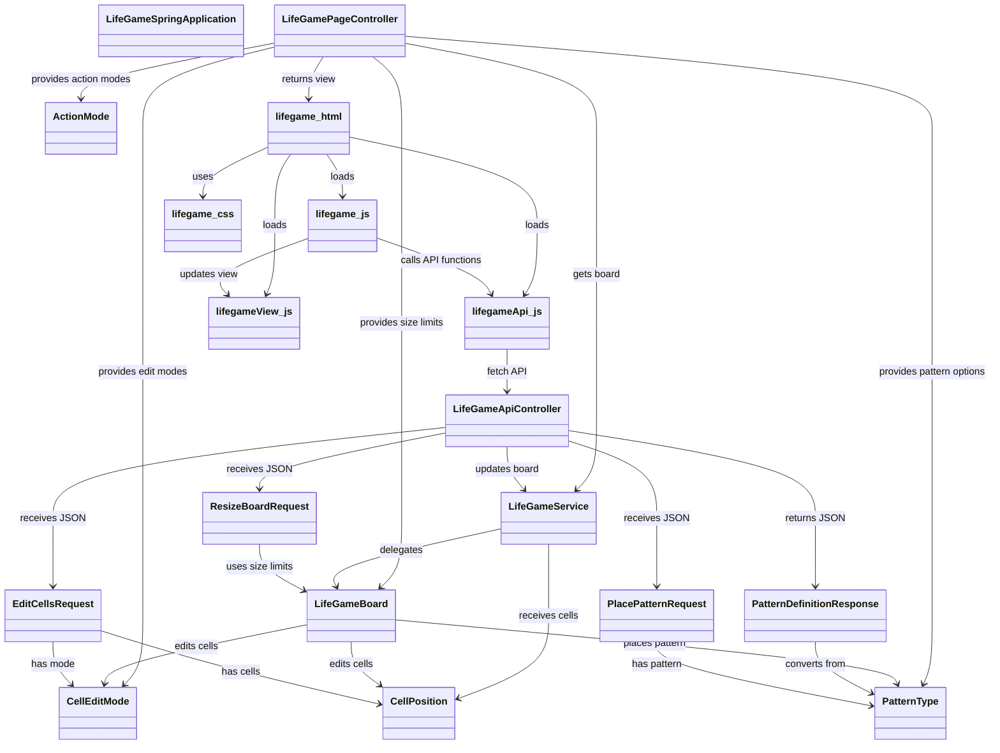
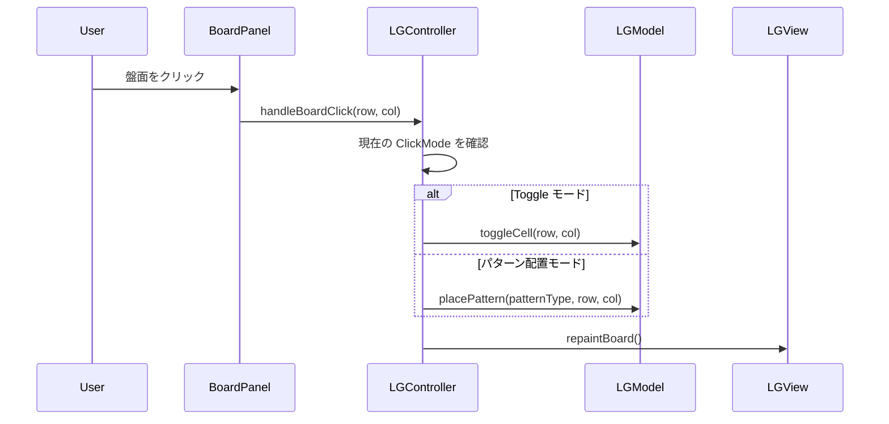
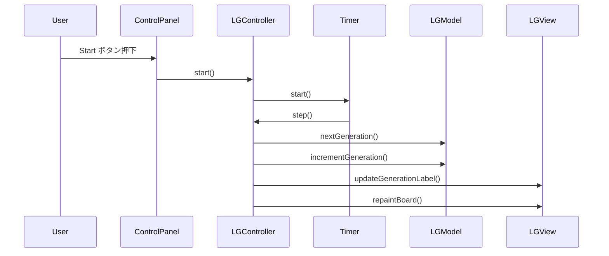
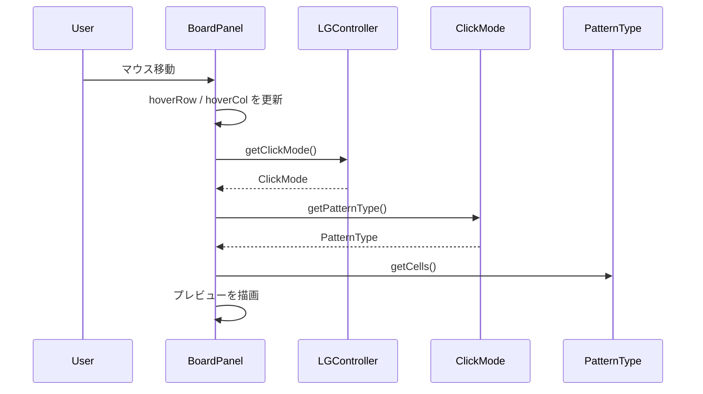
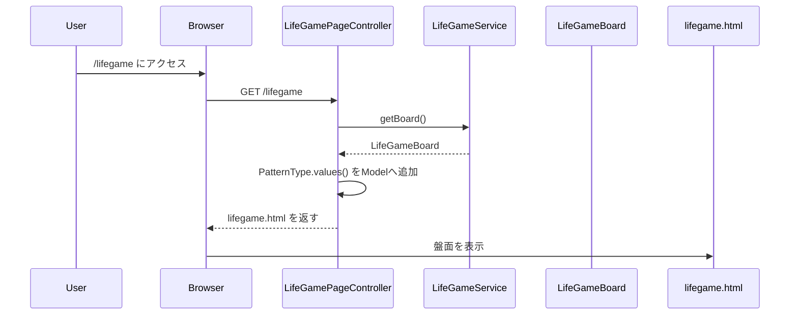
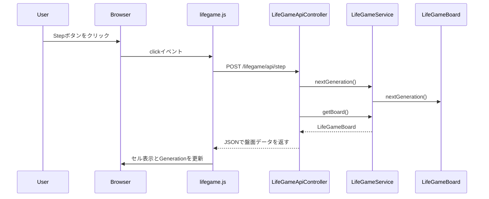
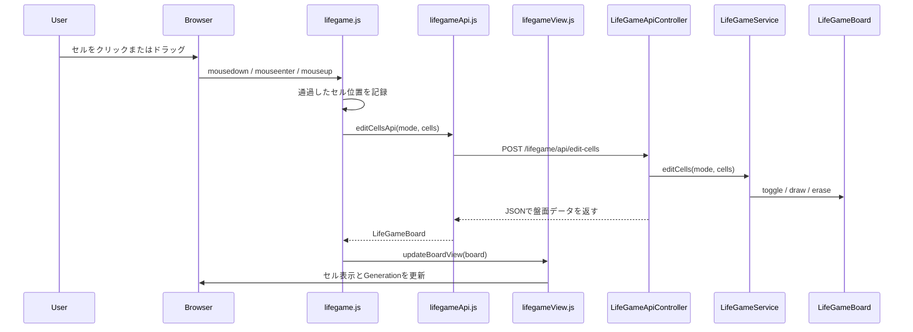
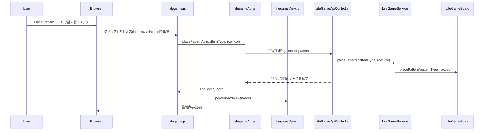

# LifeGame

ライフゲームを題材にしたJava学習用プロジェクトです。

最初にJava Swingでデスクトップアプリ版を作成し、その後、Spring Boot / Thymeleaf / JavaScriptを使ってWebアプリ版へ発展させています。

Swing版では、MVC設計、イベント駆動プログラミング、GUI部品の責務分離を学習しています。  
Spring Boot版では、Controller / Service / Model の分離、Thymeleafによる初期表示、JavaScript + fetch APIによる画面更新を学習しています。

## ■ バージョン

このリポジトリには、以下の2つの実装を含めています。

### Swing版

Java Swingで作成したデスクトップアプリ版です。  
盤面描画、マウス操作、タイマー処理、パターン配置、プレビュー表示などをSwingで実装しています。

### Spring Boot版

Spring Bootで作成したWebアプリ版です。  
Swing版で作成したライフゲームの考え方をもとに、Web画面、API、JavaScriptによる部分更新へ発展させています。

## ■ 主な機能

### 共通

- セルクリックによる ON / OFF 切り替え
- ドラッグによるセル描画（Toggleモード）
- 1世代だけ進める Step 操作
- 世代の自動更新（Start / Stop）
- ランダム配置（Random）
- 全消去（Clear）
- 初期状態へのリセット（Reset）
- 更新速度の変更（Speed スライダー）
- 世代数表示（Generation）
- クリック位置へのパターン配置
- パターン配置時のプレビュー表示

### Swing版

- 状態表示（Running / Stopped）

### Spring Boot版

- ブラウザ上でのライフゲーム盤面表示
- ブラウザセッションごとに別々の盤面状態を保持
- 盤面操作モード選択（Edit Cell / Place Pattern）
- 描画モード選択（Toggle / Draw / Erase）
- パターン配置時のプレビュー表示
  - 配置可能な場合は青色表示
  - 既存セルと重なる場合は黄色表示
  - 盤面外にはみ出す場合は赤色表示
- Simulation / Board / Edit に分けた操作UI
- 盤面サイズ変更
  - Rows: 10〜80
  - Cols: 10〜120
  - Resize時は新しい空盤面を作成
- サーバー側の入力値チェック
  - 盤面サイズの下限・上限チェック
  - セル編集時の座標範囲チェック
  - パターン配置時の基準座標チェック
  - 不正なリクエストは 400 Bad Request として返却

## ■ 操作方法

### 共通

- セルクリック  
  クリックしたセルの生死を切り替えます
- Step  
  盤面を1世代だけ進めます
- Start  
  自動更新を開始します
- Stop  
  自動更新を停止します
- Speed スライダー  
  自動更新の間隔を変更します
- Clear  
  盤面をすべてクリアします
- Reset  
  初期状態のパターンに戻します
- Random  
  盤面をランダムな状態にします
- Pattern プルダウン  
  配置するパターンを選択します

### Swing版

- ドラッグ（Toggleモード）  
  通過したセルを1回ずつ反転します

### Spring Boot版

操作UIは、以下の3つのグループに分けています。

#### Simulation

- Step  
  盤面を1世代だけ進めます
- Start  
  自動更新を開始します
- Stop  
  自動更新を停止します
- Speed  
  自動更新の間隔を変更します

#### Board

- Clear  
  盤面をすべてクリアします
- Reset  
  初期状態のパターンに戻します
- Random  
  盤面をランダムな状態にします
- Rows / Cols  
  盤面サイズを指定します。Rows は 10〜80、Cols は 10〜120 の範囲で変更できます。
- Resize  
  指定した Rows / Cols のサイズに盤面を変更します。  
  サイズ変更時は自動再生を停止し、盤面を空にして、Generation を 0 に戻します。

#### Edit

- Action Mode  
  盤面クリック時の大きな動作を切り替えます
  - Edit Cell
  - Place Pattern
- Edit Mode  
  Edit Cellモード時のセル編集方法を切り替えます
  - Toggle
  - Draw
  - Erase
- Pattern  
  Place Patternモード時に配置するパターンを選択します
- ドラッグ（Edit Cellモード）  
  選択中のEdit Modeに応じて、通過したセルをまとめて編集します
- 盤面クリック（Place Patternモード）  
  選択したパターンをクリック位置に配置します
- パターン配置プレビュー  
  配置可能な場合は青、既存セルと重なる場合は黄、盤面外にはみ出す場合は赤で表示します

## ■ 公開環境

Spring Boot版はVPS上に公開しています。

### 構成

```text
Client
↓
Nginx
↓
Spring Boot Application
↓
LifeGameService
↓
LifeGameBoard
```

### 使用している主な技術

- さくらのVPS
- Ubuntu Server
- OpenJDK 21
- Spring Boot
- Thymeleaf
- JavaScript
- Nginx
- systemd

### デプロイ構成

Spring Bootアプリケーションをjarとしてビルドし、systemdでサービス化しています。  
外部からのHTTPアクセスはNginxで受け取り、内部のSpring Bootアプリケーションへリバースプロキシしています。  

```text
Browser
↓
http://<server>/lifegame
↓
Nginx : 80
↓
Spring Boot : 8080
```

## ■ 負荷対策

Spring Boot版を公開するにあたり、最低限の負荷対策を行っています。

### Nginxによるリクエスト制限

同一IPアドレスからの過剰なリクエストを抑制するため、Nginxでリクエスト制限を設定しています。

LifeGameはStart中に一定間隔でAPIを呼び出すため、通常操作を妨げない範囲で制限値を調整しています。

### systemd / JVMによるリソース制限

JavaプロセスがVPS全体のリソースを使い切らないように、systemdとJVMオプションでCPU・メモリ使用量を制限しています。

- JVMヒープサイズの上限を設定
- systemdでメモリ使用量の上限を設定
- systemdでCPU使用率の上限を設定

### アプリケーション側の入力値チェック

APIに対して不正な値が送信された場合に備えて、Service層で入力値チェックを行っています。

- 盤面サイズの下限・上限チェック
- セル編集時の座標範囲チェック
- パターン配置時の基準座標チェック
- 一度に編集できるセル数の上限チェック
- 不正なリクエストに対する 400 Bad Request の返却

これにより、フロントエンドの入力制限を回避して直接APIを呼び出された場合でも、サーバー側で不正な操作を防ぐようにしています。

## ■ テスト

Spring Boot版では、JUnitを使ってテストを追加しています。

### 主なテスト内容

- Spring Bootアプリケーションの起動確認
- LifeGameServiceの入力値チェック
  - 範囲外の行番号を指定した場合の例外確認
  - 範囲外の列番号を指定した場合の例外確認
  - セル編集APIで不正な座標を受け付けないことの確認
  - パターン配置APIで不正な基準座標を受け付けないことの確認

### テスト実行

Spring Boot版のディレクトリで以下を実行します。

```powershell
.\mvnw.cmd test
```

## ■ パッケージ構成

### Swing版

```text
src
├─ LGMain.java            // アプリケーションのエントリーポイント
├─ controller
│  ├─ LGController.java   // 入力制御、タイマー管理、状態更新
│  └─ ClickMode.java      // 盤面クリック時の動作モード
├─ model
│  ├─ LGModel.java        // ライフゲームの状態管理と更新処理
│  └─ PatternType.java    // パターン定義と表示名
└─ view
   ├─ LGView.java         // 画面全体の構成
   ├─ BoardPanel.java     // 盤面描画とマウス入力
   └─ ControlPanel.java   // 操作UI（ボタン、スライダー、プルダウン、表示ラベル）
```

### Spring Boot版

```text
spring
├─ src/main/java/com/mkunori/lifegame
│  ├─ LifeGameSpringApplication.java        // Spring Bootアプリケーションのエントリーポイント
│  ├─ controller
│  │  ├─ LifeGamePageController.java        // ライフゲーム画面の表示を担当
│  │  ├─ LifeGameApiController.java         // JavaScriptから呼び出されるAPIを担当
│  │  ├─ request                            // JSONリクエストを受け取るrecord群
│  │  │  ├─ EditCellsRequest.java           // 複数セル編集APIのリクエスト
│  │  │  ├─ PlacePatternRequest.java        // パターン配置APIのリクエスト
│  │  │  └─ ResizeBoardRequest.java         // 盤面サイズ変更APIのリクエスト
│  │  └─ response                           // JSONレスポンスを返すrecord群
│  │     └─ PatternDefinitionResponse.java  // Java側のパターン定義をJavaScriptへ返すレスポンス
│  ├─ model
│  │  ├─ LifeGameBoard.java                 // 盤面状態、世代、サイズ、ライフゲームのルールを管理
│  │  ├─ PatternType.java                   // 配置できるパターンの種類・座標・補正値を定義
│  │  ├─ CellEditMode.java                  // Toggle / Draw / Erase を定義
│  │  ├─ CellPosition.java                  // 盤面上の1つのセル位置を表す値オブジェクト
│  │  └─ ActionMode.java                    // Edit Cell / Place Pattern を定義
│  └─ service
│     └─ LifeGameService.java               // ControllerとModelの間で処理を仲介
├─ src/main/resources
│  ├─ templates
│  │  └─ lifegame.html                      // 初期画面を表示するThymeleafテンプレート
│  └─ static
│     ├─ css
│     │  └─ lifegame.css                    // 画面デザイン
│     └─ js
│        ├─ lifegameApi.js                  // Spring Boot API呼び出しを担当
│        ├─ lifegameView.js                 // 盤面や世代数、盤面HTMLの更新を担当
│        └─ lifegame.js                     // イベント登録、自動再生、ドラッグ操作などを担当
└─ src/test/java/com/mkunori/lifegame
   ├─ LifeGameSpringApplicationTests.java   // Spring Bootアプリケーションの起動確認
   └─ service
      └─ LifeGameServiceTest.java           // Service層の入力値チェックを確認

<初期表示>
ブラウザ
↓
GET /lifegame
↓
LifeGamePageController
↓
lifegame.html

<画面操作>
lifegame.js
↓
lifegameApi.js
↓
POST /lifegame/api/...
↓
LifeGameApiController
↓
LifeGameService
↓
LifeGameBoard
↓
JSONで盤面データを返す
↓
lifegameView.js が画面を更新
```


## ■ クラス図

### Swing版



### Spring Boot版



## ■ シーケンス図

### Swing版

#### 盤面クリック時の処理



#### Startして1世代進むときの処理



#### プレビュー表示時の処理



### Spring Boot版

#### 初期表示



#### Step API



#### セル編集API（クリック / ドラッグ）



#### パターン配置API（クリック位置に配置）



## ■ 今後の改善

### Spring Boot版

- 負荷対策のさらなる改善
  - セッション数が増えた場合の扱い
  - ログ量の確認
  - APIエラー時の画面表示改善
- レスポンシブ表示の改善
- JavaScriptのさらなる責務分離
- パターン追加
- テストコードのさらなる充実
- HTTPS化
- 独自ドメインでの公開

## ■ 学習ポイント

### Swing版

- Swing による GUI 開発
- MVC設計の実践
- イベント駆動プログラミング
- View の責務分離
- enum を使った状態管理

### Spring Boot版

- Spring BootによるWebアプリケーション開発
- Controller / Service / Model の責務分離
- `@Controller` と `@RestController` の使い分け
- Thymeleafによる初期画面表示
- JavaScriptのfetch APIによる非同期通信
- JSONを使った画面更新
- JSONリクエストを `@RequestBody` と record で受け取る実装
- enumを使ったパターン選択、操作モード、編集モードの管理
- ドラッグ描画時に複数セルをまとめて送信するAPI設計
- JavaScriptファイルの責務分離
  - API呼び出し
  - 画面更新
  - イベント制御
- JavaScriptによるパターン配置プレビューの実装
- UIを Simulation / Board / Edit に分ける画面整理
- VPSを使ったSpring Bootアプリケーションの公開
- Nginxによるリバースプロキシ設定
- systemdによるJavaアプリケーションのサービス化
- SSH鍵認証、rootログイン無効化、ファイアウォール設定などの基本的なサーバー初期設定
- Nginx / systemd / JVMによる最低限の負荷対策
- Service層でのサーバー側入力値チェック
- JUnitによるService層の単体テスト