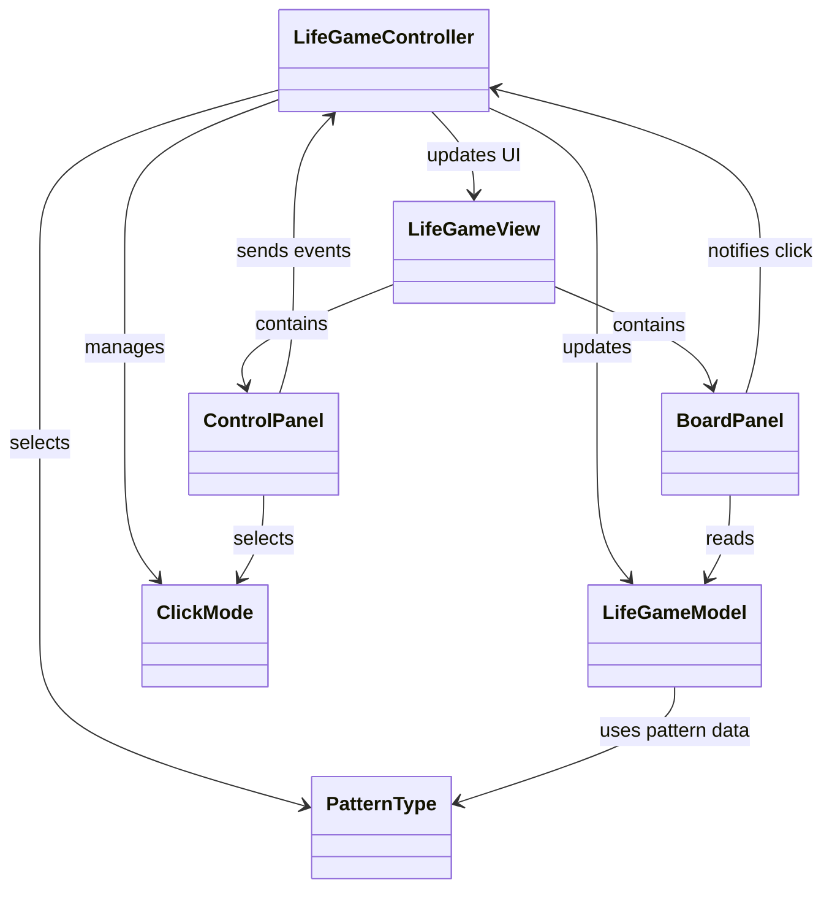
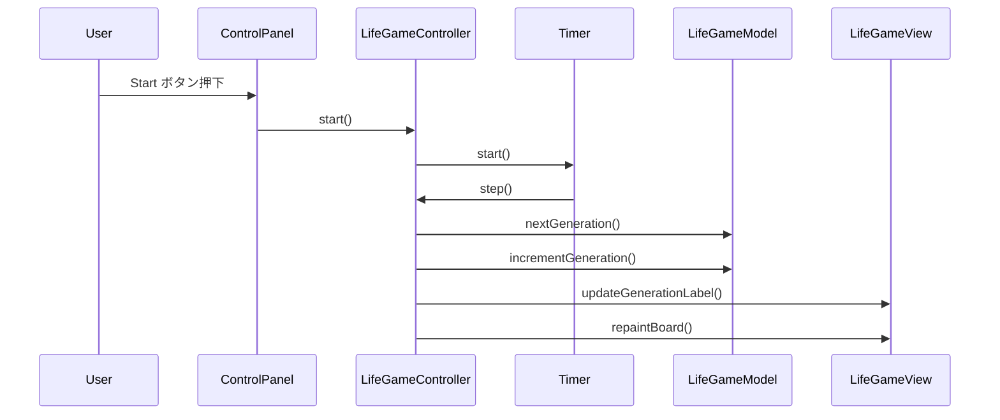
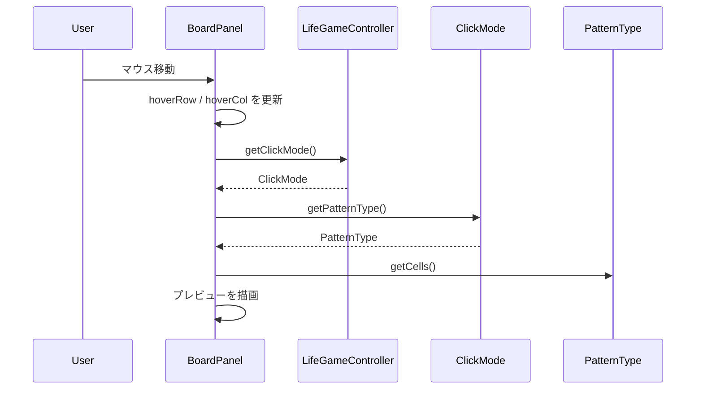

# LifeGame1Go

Java と Swing で作成したライフゲームアプリです。  
シンプルな構成から作り始め、MVC設計やリファクタリングを通して段階的に機能を拡張しています。

---

## ■ アプリ概要

ライフゲーム（Conway's Game of Life）をシミュレーションできるデスクトップアプリです。

マウス操作でセルの状態を切り替えたり、各種パターンを配置したりしながら、世代ごとの変化を視覚的に確認できます。

---

## ■ 主な機能

- セルのクリックによる ON / OFF 切り替え
- ドラッグによるセル描画（Toggleモード）
- 世代の自動更新（Start / Stop）
- ランダム配置（Random）
- 全消去（Clear）
- 更新速度の変更（JSlider）
- 世代数表示（Generation）
- 状態表示（Running / Stopped）
- Start / Stop ボタンの有効・無効制御
- モード選択用プルダウン

### パターン配置

- Glider
- Block
- Blinker
- Toad
- Beacon
- Gosper Glider Gun

### プレビュー機能

- マウス位置にパターンの仮配置を表示
- 配置可能な場合：半透明表示
- 配置不可な場合：赤色表示

---

## ■ 操作方法

- 盤面クリック  
  現在のモードに応じてセルの反転またはパターン配置を行います

- ドラッグ（Toggleモード）  
  通過したセルを1回ずつ反転します

- Start  
  シミュレーションを開始します

- Stop  
  シミュレーションを停止します

- Random  
  盤面をランダムな状態で初期化します

- Clear  
  盤面をすべてクリアします

- Speed スライダー  
  世代更新の間隔を変更します

- Mode プルダウン  
  クリック時の動作モードを切り替えます
  - Toggle
  - Glider
  - Block
  - Blinker
  - Toad
  - Beacon
  - Gosper Glider Gun

---

## ■ 使用技術

- Java
- Swing
- MVC設計

---

## ■ パッケージ構成

```text
Main                         // エントリーポイント

controller
├─ LifeGameController        // 入力制御、タイマー管理、状態更新
└─ ClickMode                 // 盤面クリック時の動作モード

model
├─ LifeGameModel             // ライフゲームの状態管理と更新処理
└─ PatternType               // パターン定義と表示名

view
├─ LifeGameView              // 画面全体の構成
├─ BoardPanel                // 盤面描画とマウス入力
└─ ControlPanel              // 操作UI（ボタン、スライダー、プルダウン、表示ラベル）
```

---

## ■ クラス図



---

## ■ シーケンス図

### 盤面クリック時の処理


### Startして1世代進むときの処理



### プレビュー表示時の処理



---

## ■ 設計方針

### MVCパターンを採用

- Model  
  盤面状態、世代管理、パターン配置、次世代計算などのデータとルールを担当

- View  
  画面描画および UI 部品の表示を担当

- Controller  
  ユーザー操作、タイマー制御、状態遷移、クリックモードの制御を担当

---

### Viewの分割

画面の責務を明確にするため、View を以下のように分割しています。

- BoardPanel  
  盤面描画と盤面クリックの受付を担当

- ControlPanel  
  ボタン、スライダー、プルダウン、状態表示を担当

- LifeGameView  
  画面全体のレイアウト管理を担当

---

### パターン定義の分離

配置パターンは `PatternType` にまとめ、モデル側では共通の配置処理を使うようにしています。

これにより、新しいパターンを追加するときは

- `PatternType` にパターンを追加する
- 必要に応じて `ClickMode` や UI に追加する

という流れで拡張できるようにしています。

---

## ■ 学習ポイント

- Swing による GUI 開発
- MVC設計の実践
- イベント駆動プログラミング
- Timer を使った更新処理
- View の責務分離
- enum を使った状態管理
- 定数化による可読性向上
- パターンデータと配置処理の分離
- プレビュー描画（描画と状態の分離）

---

## ■ 今後の追加予定

- ループ検出や停止条件の強化
- 保存 / 読み込み機能

---

## ■ 開発方針

- 小さく作ってから段階的に拡張する
- 可読性を重視した実装を心がける
- 初学者でも追いやすい構造を意識する
- Javadoc によるドキュメント整備を行う