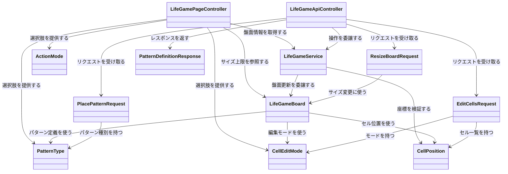
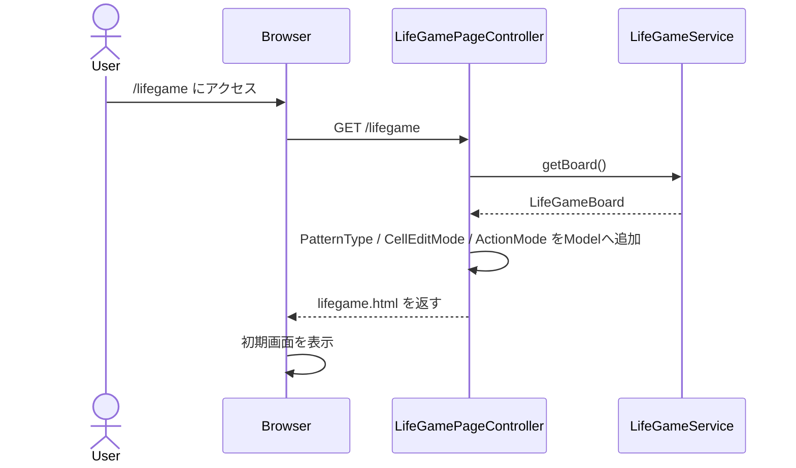
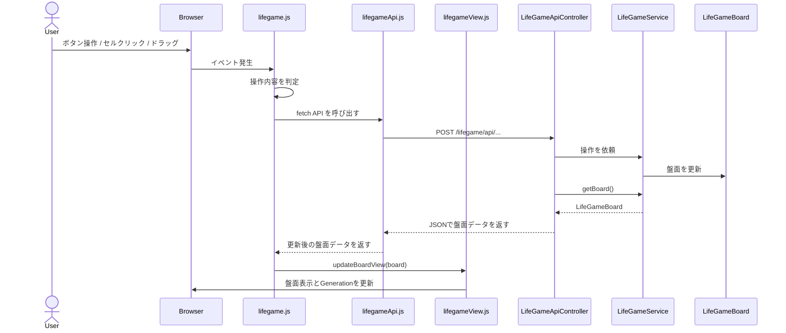

# LifeGame

## ■ 概要

LifeGameは、ライフゲームを題材にしたJava / Spring BootのWebアプリケーションです。

ブラウザ上でセルを編集し、世代更新、パターン配置、盤面サイズ変更などを操作できます。  
Spring Boot / Thymeleaf / JavaScriptを使い、初期表示はサーバー側で行い、盤面操作はfetch APIによる非同期通信で更新しています。

現在は、さくらのVPS上にデプロイし、独自ドメインとHTTPSで公開しています。

なお、開発初期に作成したJava Swing版も参考実装として含めています。  

## ■ 公開URL

Spring Boot版を以下のURLで公開しています。  
https://mkunori.com/lifegame

## ■ 使い方

公開URLにアクセスし、画面上の操作UIからライフゲームを操作できます。

- Simulation: Step / Start / Stop / Speed
- Board: Clear / Reset / Random / Resize
- Edit: セル編集、ドラッグ描画、パターン配置

詳細な操作は画面上のボタン・選択項目に従って行います。

## ■ 主な機能

Spring Boot版では、以下の機能を実装しています。

### シミュレーション操作

- 1世代だけ進める Step 操作
- 世代の自動更新 Start / Stop
- 更新速度の変更
- 世代数の表示
- ランダム配置
- 全消去
- 初期状態へのリセット

### セル編集

- セルクリックによる生死状態の切り替え
- ドラッグによる複数セル編集
- 編集モードの切り替え
  - Toggle
  - Draw
  - Erase

### パターン配置

- クリック位置へのパターン配置
- パターン配置プレビュー
  - 配置可能な場合は青色表示
  - 既存セルと重なる場合は黄色表示
  - 盤面外にはみ出す場合は赤色表示

### 盤面サイズ変更

- Rows: 10〜80
- Cols: 10〜120
- Resize時は新しい空盤面を作成
- Generationを0にリセット

### サーバー側の入力値チェック

- 盤面サイズの下限・上限チェック
- セル編集時の座標範囲チェック
- パターン配置時の基準座標チェック
- 一度に編集できるセル数の上限チェック
- 不正なリクエストは 400 Bad Request として返却

## ■ 技術構成

### Webアプリケーション

- Java 21
- Spring Boot
- Thymeleaf
- JavaScript
- fetch API
- JUnit

### アプリケーション設計

- Controller / Service / Model の分離
- JSON APIによる画面更新
- recordを使ったリクエストDTO
- Service層での入力値チェック

## ■ 公開環境

Spring Boot版は、さくらのVPS上にデプロイし、独自ドメインとHTTPSで公開しています。

```text
Browser
↓
HTTPS
↓
Nginx
↓
Spring Boot Application : 8080
```

### 主な構成

- さくらのVPS
- Ubuntu Server
- OpenJDK 21
- Nginx
- systemd
- Let's Encrypt / Certbot

## ■ 負荷対策

公開環境で動作させるため、以下の最低限の負荷対策を行っています。

- Nginxで同一IPからの過剰なリクエストを制限
- systemd / JVMオプションでJavaプロセスのCPU・メモリ使用量を制限
- Service層でAPIリクエストの入力値を検証
  - 盤面サイズ
  - セル座標
  - パターン配置位置
  - 一度に編集できるセル数

不正なリクエストは 400 Bad Request として返却します。

## ■ テスト

Spring Boot版では、JUnitを使ってテストを追加しています。

### 主なテスト内容

- Spring Bootアプリケーションの起動確認
- Service層の入力値チェック
  - 範囲外の行番号を受け付けないこと
  - 範囲外の列番号を受け付けないこと
  - セル編集APIで不正な座標を受け付けないこと
  - パターン配置APIで不正な基準座標を受け付けないこと

### テスト実行

Spring Boot版のディレクトリで以下を実行します。

```powershell
.\mvnw.cmd test
```

## ■ パッケージ構成

### Spring Boot版

```text
spring
├─ src/main/java/com/mkunori/lifegame
│  ├─ LifeGameSpringApplication.java        // Spring Bootアプリケーションのエントリーポイント
│  ├─ controller
│  │  ├─ LifeGamePageController.java        // ライフゲーム画面の表示を担当
│  │  ├─ LifeGameApiController.java         // JavaScriptから呼び出されるAPIを担当
│  │  ├─ request                            // JSONリクエストを受け取るrecord群
│  │  │  ├─ EditCellsRequest.java           // 複数セル編集APIのリクエスト
│  │  │  ├─ PlacePatternRequest.java        // パターン配置APIのリクエスト
│  │  │  └─ ResizeBoardRequest.java         // 盤面サイズ変更APIのリクエスト
│  │  └─ response                           // JSONレスポンスを返すrecord群
│  │     └─ PatternDefinitionResponse.java  // Java側のパターン定義をJavaScriptへ返すレスポンス
│  ├─ model
│  │  ├─ LifeGameBoard.java                 // 盤面状態、世代、サイズ、ライフゲームのルールを管理
│  │  ├─ PatternType.java                   // 配置できるパターンの種類・座標・補正値を定義
│  │  ├─ CellEditMode.java                  // Toggle / Draw / Erase を定義
│  │  ├─ CellPosition.java                  // 盤面上の1つのセル位置を表す値オブジェクト
│  │  └─ ActionMode.java                    // Edit Cell / Place Pattern を定義
│  └─ service
│     └─ LifeGameService.java               // ControllerとModelの間で処理を仲介
├─ src/main/resources
│  ├─ templates
│  │  └─ lifegame.html                      // 初期画面を表示するThymeleafテンプレート
│  └─ static
│     ├─ css
│     │  └─ lifegame.css                    // 画面デザイン
│     └─ js
│        ├─ lifegameApi.js                  // Spring Boot API呼び出しを担当
│        ├─ lifegameView.js                 // 盤面や世代数、盤面HTMLの更新を担当
│        └─ lifegame.js                     // イベント登録、自動再生、ドラッグ操作などを担当
└─ src/test/java/com/mkunori/lifegame
   ├─ LifeGameSpringApplicationTests.java   // Spring Bootアプリケーションの起動確認
   └─ service
      └─ LifeGameServiceTest.java           // Service層の入力値チェックを確認
```

### Swing版 参考実装

```text
src
├─ controller   // 入力制御、タイマー管理
├─ model        // 盤面状態、世代更新、パターン定義
└─ view         // Swing画面、盤面描画、操作UI
```

## ■ クラス図



## ■ シーケンス図

### 初期表示



### 画面操作API



## ■ Swing版について

本リポジトリには、Spring Boot版の前段階として作成したSwing版も含めています。

Swing版では、ライフゲームの基本ロジック、MVC設計、マウスイベント、Timerによる自動更新を実装しました。  
その後、同じ題材をSpring Boot版へ発展させ、ブラウザ操作、JSON API、JavaScriptによる非同期更新、VPS公開へつなげています。

現在のメイン実装はSpring Boot版です。  
Swing版は、開発経緯と学習過程を示す参考実装として残しています。

## ■ 学習ポイント

このプロジェクトでは、ライフゲームを題材に、Spring BootによるWebアプリケーション開発からVPS公開までを実践しました。

### Webアプリケーション開発

- Controller / Service / Model の責務分離
- Thymeleafによる初期表示
- JavaScript + fetch API による非同期更新
- JSON APIとrecord DTOによるリクエスト処理
- Service層での入力値チェック
- JUnitによるService層の単体テスト

### 公開・運用

- VPS上でのSpring Bootアプリケーション公開
- Nginxによるリバースプロキシ設定
- systemdによるJavaアプリケーションのサービス化
- 独自ドメインとLet's Encrypt / CertbotによるHTTPS化
- Nginx / systemd / JVMによる最低限の負荷対策

### ライフゲーム実装

- 2次元配列による盤面管理
- 周囲8マスをもとにした世代更新ロジック
- パターン配置、プレビュー表示、盤面サイズ変更

## ■ 今後の改善

### アプリケーション機能

- パターンの追加
- 盤面外にはみ出すパターン配置の扱い整理
- レスポンシブ表示の改善
- APIエラー時の画面表示改善

### コード設計

- JavaScriptのさらなる責務分離
- Service層・Model層のテスト追加
- Controller層のテスト追加

### 公開・運用

- アクセスログやアプリケーションログの確認方法整理
- セッション数が増えた場合の扱い検討
- 複数アプリを同一VPSで運用する構成の整理